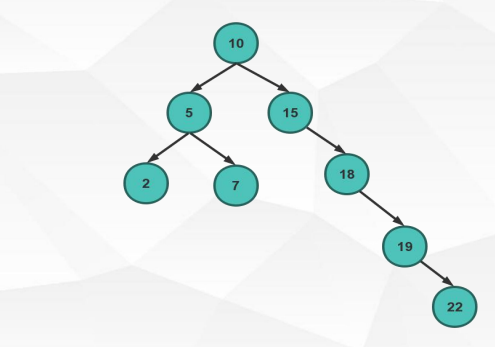
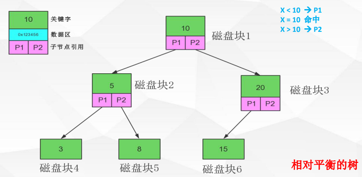
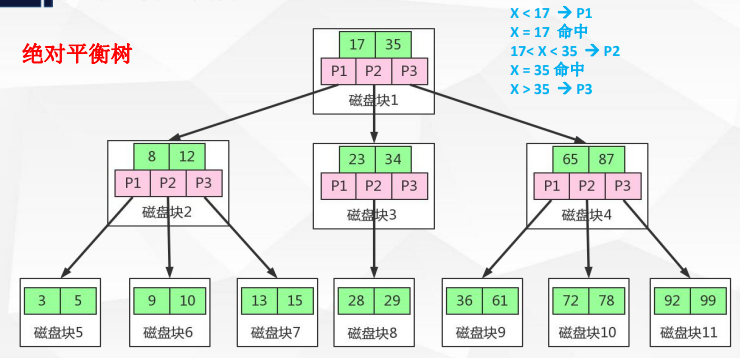
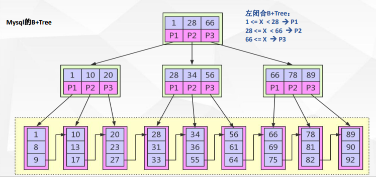

# 索引机制

## 定义

索引是为了加速对表中数据行的检索而创建的一种分散存储的数据结构

索引是硬盘级的数据结构

## 为什么要用索引

1. 索引能极大的减少存储引擎需要扫描的数据量
2. 索引可以把随机 IO 变成顺序 IO
3. 索引可以帮助我们再进行分组,排序等操作时, 避免使用临时表

## 为什么是 B+ Tree

### 二叉树

**根节点**, 第一个插入的就是根节点

##### 基本概念

1. 第一个插入的数据作为根节点
2. 每一个节点的左子节点都比他小
3. 每一个节点的右子节点都比他大

##### 问题

* 每一个叶子只能存储一项数据
* 很容易出现数据分布不均匀导致检索效率问题

### 平衡二叉树

**高度差: **一个节点的左子节点和右子节点的长度的差就叫高度差, 如上图中 20 这个节点只有一个左子节点, 右侧没有, 那么 20
这个节点的高度差就是 1

##### 基本概念

平衡二叉树分为两种, 红黑树就是一颗平衡二叉树

1. 完全平衡二叉树(AVL), 整颗树的高度差不会超过 1
2. 相对平衡二叉树, 某一个节点的高度差不会超过 1

平衡二叉树可以自动调整节点, 用来保证高度差不会超过 1, 如上图中 15 这个节点, 我们再插入一个节点 6, 此时 20 的高度差超过了
1, 因为 20 的左子节点的长度是 2, 右子节点没有, 此时会把 15 替换到 20 的位置, 然后 20 放在 15 的右子节点, 新加入的节点 6
放在 15 的左子节点, 即做了一个类似于旋转的操作(向右旋转), 基本过程如下

1. 将节点 6 先放到 15 的左子节点
2. 检查 20 的高度差发现大于 2
3. 将节点 6 放在 20 的右子节点
4. 然后 20,15,6 形成的三角形向右旋转一下

##### 问题

1. 太深了, 数据处的(高)深度决定着他的 IO 操作次数, IO 操作耗时大
2. 太小了, 每一个磁盘块(节点/页)保存的数据太小了

**没有很好的利用磁盘 IO 的数据交换特性, 也没有利用好磁盘 IO 的预读能力(空间局部性原理), 从而带来频繁的 IO 操作.**

**操作系统的 IO 操作(操作系统从硬盘读取数据到内存), 一次交互的数据的大小是 4K, MySQL 定义的一页大小为 16K**

**磁盘的预读能力(空间局部性原理): 如果一次加载了 4K 的数据之后, 操作系统会认为后续的数据也是需要使用到的,
操作系统会继续加载后面的一部分数据**

### 多路平衡查找树, B-Tree

是一棵绝对平衡树

**检索是依靠范围检索**

##### 定义

* 多路:子节点允许有多条分叉, 数量需要预先定义好, 如: m 路
* 每一个节点的关键字(索引存储的内容)的个数最多只有 m-1 个, 因为检索是依靠范围检索的, 且是开放区间(即区间的规定只用大于和小于来限定,
  等于认为是当前自身)

##### 查找方式

**注: 效率与二叉树比较差距不大, 但一次查询的数据要多很多**

如上图, 每一个节点绿色的是存储的数据库表的 id, 红色的是每一个分叉的位置, 那么要查找 id=15 的过程如下

1. 把根节点的数据加载到内存当中
2. 根节点存储的 id 分别为 17,35 两个
    1. 如果要查询的 id 比 17 小, 那么就沿着 P1 这条路继续往下走
    2. 如果要查询的 id 大于 17 小于 35, 那么就沿着 P2 这条路继续往下走
    3. 如果要查询的 id 大于 35, 那么就沿着 P3 这条路继续往下走
    4. 如果正好命中 17或35, 那么就直接返回根节点的数据区
3. 其它情况以此类推

**按照 MySQL 中的设定, 1 页的大小是 16K(byte = 16 * 1024), 而 int 类型也才只占 4 byte, 那么在 B-Tree
树中一个节点能够保存的路数就可以很容易推算出来**

**所以我们在定义索引的时候, 要求字段尽量的短, 就是为了增加树的路数**

**注: MySQL 是记录取决于关键字的大小**

**注: 相同的索引值实际上是分布在两个不同的叶子上的, 即发现相同的值, 就默认它的值比当前的值大, 然后将其放到右子节点上去**

**注: 索引并不是越多越好, 为了保证一棵树的平衡, 在增删改的情况下, 索引需要做很多的操作来维护, 从而浪费很多的性能**

### 加强版多路平衡查找树, B+ 树

##### 定义

* 采用左闭合区间, 即使用 大于等于的范围检索, 因为数据是保存在数据区的, 即时关键字相等, 也还是要继续往下找, 一直找到数据区.
  因为 MySQL 主推的是递增的数字 id, 而递增的特性是新增的数据一定是要放到右侧的, 所以采用了左侧闭合的区间.
* 非叶节点不保存数据, 只保存关键字和子节点的引用
* 数据全部保存在叶子节点中(数据区中)
* 叶子节点是顺序排列的, 并且相邻节点具有顺序引用的关系, 每一个叶子节点的最后一条数据指向相邻节点的第一条数据, 如: 9 ->
  10

##### 为什么用 B+Tree

* B+树是 B-树的变种(Plus 版), 多路绝对平衡查找树, 它拥有 B-树的优势
* B+树扫库,表能力更强, 在B-树中, 因为数据是存放在节点中的, 如果我们要查询多条, 那么我们需要每一个子节点都要去找, 而
  B+树的数据是存放在数据区, 而数据区的数据是顺序排放的, 所以只需要去扫描数据区即可查询到列表
* B+ 树的磁盘读写能力更强, 因为 B+ 树的直接点是不保存数据的, 都是用来保存关键字的, 所以它一个支节点能保存的关键字就更多,
  那么它的磁盘读写能力就更强
* B+ 树的排序能力更强, 这得益于数据区的顺序排放
* B+ 树的查询效率更加稳定, 这个就不好说了, 因为 B+ 树的寻址一定会查找到存放数据的叶子节点, 也就是无论有多少层都要走完,
  而如果只查询一条数据的情况下, B- 树如果运气好可能只需要往下走一两层就可以完成查找.

## MySQL B+Tree 索引体现形式

frm: 表定义文件, 每一个存储引擎都会有

##### 查看表创建 DDL

`SHOW CREATE TABLE t_account`

##### 查看数据存储目录

`SHOW VARIABLES LIKE 'datadir';`

### Myisam

* MYD: 用于保存数据
* MYI: 用于保存索引

**数据和索引分别存储**

**在 Myisam 中索引的数据区, 保存的是记录在 MYD 文件中的物理磁盘位置**

##### 多列索引形式

### InnoDB

ibd: 索引和数据均放在这里面

**数据和索引存储在一起**

**以主键为索引来组织数据的存储**

**注: 在 InnoDB 中如果没有明确的定义主键, 那么这个表会默认的定义一个 int 类型的主键, 用于排列数据的顺序.**

在 InnoDB 中, 索引分为两种

1. 主键索引: 默认使用主键做索引, 数据放在最下层的叶子节点中
2. 辅助索引: 自己创建的索引, 另外一颗树, 数的结构跟主键索引是一样的, 但辅助索引的数据区存放的是这条数据的主键值,
   查询方式是先通过辅助索引找到主键, 然后再拿主键去主键索引找到数据

**注: InnoDB 辅助索引的查询机制主要是由 InnoDB 的设计初衷决定的, InnoDB 设计的时候认为, 绝大多数情况下,
我们的查找都是依靠主键来进行查询的**

## 知识点

### 索引的排序规则

任何字段都可以进行排序, 如字符串等, 这个取决于创建数据库时选择的排序规则, 默认: `utf8mb4_0900_ai_ci`, 这个是基于 ASCII
来进行处理字符串排序的.

### 列的离散性

计算公式: `count(distinct col): count(col)`

上图中, name 的离散性是最好的, 因为没有重复, 按照计算共识, 得到的结果为 1, sex 是离散性最差的

**注: 比例越大离散性越好, 离散性越好, 选择性越好.**

**原因: 以 sex 字段举例, 因为只有 0和1 两个值, 在 B+ 树中的结构会处于很多条分支中, 即右侧的很多条分叉都会存储 1,
导致索引查询需要检索好多条分叉才能做到. 离散性越好就能更快速的找到要检索的数据.**

**注: 在使用索引进行查询的时候会先使用选择优化器来决定到底是用哪个索引, 用不用索引, 如果离散性特别差,
那么选择优化器就会放弃使用索引而转为全表扫描, 因为用索引还不如使用全表扫描来的快.**

### 最左匹配原则

**对索引中的关键字进行计算(对比), 一定是从左往右一次进行, 且不可跳过.**

如: a,b,c,d 四个字母在 ASCII 中分别用 97,98,99,100 四个数字来代表的, 在实际检索的时候需要按照 ASCII 来从左往右依次比对.
如: 有一个 name 的值为 abc(97, 98, 99), 然后 adc(97, 100, 99) 是一定是在 abc 的右侧子节点上, 因为 100 大于 98

所以, 按照上面的描述来看, `LIKE '%bc'` 为什么会使索引失效就一目了然了, 而 LIKE `ab%` 为什么不会使索引失效也很清楚了.
因为 `ab%` 按照最左原则, 其至少能使用索引匹配 ab 两个字母, 后面的依然是需要进行扫描

### 联合索引

联合索引和单列索引的数据结构都是一样的, 只不过单列索引中的索引值只有一个字段的值, 而联合索引的索引值是多个字段拼接起来的.

如: 单列索引, 节点中的关键字 `[name]`, 只有 name 一个列的数据作为索引值
如: 联合索引, 节点中的关键字 `[name,mobile]`, 将 name和mobile 两个列的数据拼接起来作为索引值

**所以: 单列索引起始是一个特殊的联合索引**

联合索引列选择原则

1. 经常用的列优先, 最左匹配原则导致
2. 选择性(离散度)高的列优先, 离散度高原则导致, 离散度越高越精准
3. 宽度小的列优先, 最少空间原则, 可以更多的拓宽路数

##### 冗余的索引问题

查询语句:

SELECT * FROM users WHERE name = ?;

SELECT * FROM users WHERE name = ? AND phoneNum = ?

基于以上两条慢 sql 优化索引

创建索引 1: `create index idx_name on users(name);`

创建索引 2: `create index idx_name_phoneNum on users(name,phoneNum);`

**索引 1 是冗余的, 按照最左匹配原则, 索引 2 中 name 排在前面, 第一条 sql 是可以用到索引 2 的**

**联合索引中也会有段(字段)的概念**

**如果 sql 中只用到了 phoneNum, 那么是无法使用到索引 2 的, 原因还是因为最左原则**

**注: 一条单表 SQL 最多只能用到一个索引, 至于用哪个这个是由 sql 优化器推荐的**

##### 覆盖索引

如果查询列可以通过索引节点中的关键字直接返回, 则该索引称之为覆盖索引

如 sql: `SELECT name FROM users WHERE name = ?`

如果在 name 上添加索引, 那么以上 sql 会用到 name 索引, 且返回结果也只需要返回 name, 而 name 的值又实际存储在索引树的非数据节点上,
这种情况就是覆盖索引.

覆盖索引可减少数据库 IO, 将随机 IO 变为顺序 IO, 可提高查询性能.

为什么不能使用不能使用 `SELECT *`, 因为明确字段有可能会命中覆盖索引, 且如果指定明确的列也可以减少网络 IO 的消耗

`SELECT COUNT(*)` 能够命中覆盖索引, 而 COUNT 具体的列却不可以, 即时这个列设置了 NOT NULL 也不可以.

## 优化

1. 要创建索引的时候, 这个字段尽量不要允许为 null, 为 null 会加重索引的计算, null 也需要额外的空间来保存
2. 索引列的数据长度能少则少
3. 索引一定不是越多越好, 越全越好, 一定是建合适的
4. `LIKE %9999%` 和 `LIKE %9999`用不到索引, 匹配列前缀 `LIKE 9999%` 也不一定能用到索引, 这取决于提供的前缀的离散度是否足够高,
   如果离散性非常差, 那么优化器并不会推荐使用索引
5. WHERE 条件中, `NOT IN` 和 `<>` 操作无法使用索引, 归根结底就是选择性差的原因, 比如说不等于 3 这个检索, 放到 B+ 树中,
   到底是往哪一路走这个是无法判断出来的, 所以无法用到索引
6. 匹配范围值, `ORDER BY` 也可以用到索引, 因为本身数据就是顺序排列的, 尤其是范围检索, 肯定是可以用到索引的, 实际上在 SQL
   优化器处理的时候会进行一下数据的选样, 离散性如果大于 15% 那么就可以用到索引, 如果低于这个值那么还不如进行全表扫描
7. 多用指定列查询, 只返回自己想要的数据列, 少用 `SELECT *`
8. 联合索引中如果不是按照索引最左列开始查找, 无法使用索引
9. 联合索引中精确匹配最左前列, 并范围匹配另外一列可以用到索引. 如: `WHERE name = ? AND phoneNum > ?`, 这样子是可以用到联合索引的,
   但如果第一列是个范围, 那么是用不到的
10. in 和 or 在离散性很差的情况下, 也不一定会用到索引
