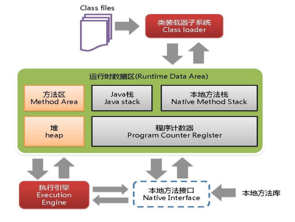

# JVM

Java 虚拟机

## 概述

## 体系结构

1. [类文件(Class files)](jvm01-类文件.md)
2. [类装载器子系统(Class Loader)](jvm02-类装载器.md)
3. [JVM 运行时数据区 (Runtime Data Area)](jvm03-运行时数据区.md)
    1. 方法区(Method Area)
    2. 堆(Heap)
    3. Java 栈(Java Stack)
    4. 本地方法栈(Native Method Stack)
    5. 程序计数器(Program Counter Register)
4. 执行引擎(Execution Engine): 负责解释命令, 提交给操作系统执行
5. 本地方法接口(Native Interface): 本地方法接口的作用是融合不同的编程语言为 Java 所用, Java 是不能够直接操作底层代码的,
   所以需要使用 native method 用来调用本地方法.
6. 本地方法库

**简单理解就是类装载器加载类文件到运行时数据区, 然后再由执行引擎执行里面的代码**

