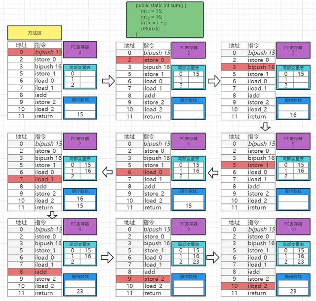

# 栈帧数据(Frame Data)

一个栈帧可以理解成一个方法, 即各种方法的相互调用就会形成一个个的栈帧.

## 局部变量表(Local Variables)

又被成为本地变量表.

定义为一个数组, 主要用于存储方法参数和定义在方法体内的局部变量.
其能存储的数据类型包括 8 种基础数据类型+对象引用(reference)+返回地址(ReturnAddress)

由于栈是线程私有的, 所以本地变量表也是线程的私有数据, 因此不存在数据安全问题.

##### 槽(slot)

局部变量表的最小单位是槽(slot), 分为 32位和64位 两种, 这个具体取决于具体的运行环境, 即一个 slot 占 32位还是64位
是由运行的环境所决定的.

像 byte 这种不满 32 位的数据类型它会被转成 32位/64位 去存储.
像 long 这种 64 位的数据类型如果在 32 位的机器上它会被转成两行 32位 的 slot, 即进行两次操作.
引用类型(reference), 相当于一个指针, 指向了一个对象, 在 32位的平台上一个指针占 32 位, 64 位平台上占 64 位, 即在 64
位的机器上只需要一条指令就可以找到引用指向的对象.
在 64 位的操作系统上, 所有的数据类型都栈 1 个 slot; 在 32 位操作系统上, 数据类型至少占 1 个 slot, 也有可能占 2 个 slot.

参数值的存放总是从局部变量数组的 index 0 开始, 到数组长度 -1 的索引位置结束.
当一个实例方法被调用的时候, 它的方法参数和方法体内部定义的局部变量将会按照顺序被复制到局部变量表中的每一个 slot 上.
如果需要访问局部变量表中的一个 64 位的局部变量值时, 只需要使用前一个索引即可.

如果当前帧是由构造方法或实例方法创建的, 那么该对象引用 this 将会存放在 index = 0 的 slot 处, 其它参数按照参数表顺序排列.

局部变量表中的 slot 是可以被复用的(即被 gc 优化).
如果一个变量没有发生逃逸, 那么他所占的 slot 是不会被复用的, 也不会被编译器优化.
当一个变量的 pc 寄存器的值大于 slot 的作用域的时候, slot 可以复用, 即某个变量逃逸出了当前方法的作用域,
那么它是可以被 gc 所优化的, 再其作用域之后申明的新的局部变量就很可能复用它的槽位, 从而达到节省资源的目的.

##### 静态变量和局部变量的区别

类变量有两次初始化的操作, 第一次是在 "准备阶段", 类变量会被设置零值, 另一次则是在 "初始化" 阶段, 赋予程序员在代码中定义的初始值.

局部变量表不存在系统初始化的过程, 这意味着一旦定义了局部变量则必须人为的初始化, 否则无法使用.

## 操作数栈(Operand Stack)

用于保存指令计算过程的中间结果, 同时作为计算过程中变量临时的存储空间. 操作数栈就是变量操作的中间容器.

##### 操作数栈的深度

查看 class 方法的 Code 属性中, stack 就是栈的深度

操作数栈的深度, 已知一个方法就是一个栈帧, 方法中调用其它的方法就会增加栈帧, 每增加一个栈帧深度就 +1.
死循环的时候会不断增加操作数栈的深度, 最终会导致OOM(栈内存溢出), 栈溢出的时候要么调整栈内存的大小, 要么就避免写出死循环这种情况.

### 求和 局部变量表,操作数栈,PC寄存器 流程

## 动态链接(Dynamic Linking)

栈帧所对应的具体方法, 指向了方法区(方法区如果用到了一些常量方法区也会指向常量池).

在代码中调用一个方法的时候, 因为方法是存储在方法区中的, 方法区中的每一个方法都是一段内存, 他们都会有一个内存地址(
引用地址), 在调用方法的时候 jvm 会进行一个动态绑定的过程, 即在调用方法的时候,
这行指令会动态绑定到具体方法区中的要被执行的那个方法(指向方法区方法的所在的那块内存),
这个就叫做动态绑定, 就是在运行时才能够知道具体引用的方法的地址是什么.

### 方法的调用

#### 解析调用

##### 静态绑定, 在类加载的连接解析阶段, 会将方法引用(符号引用)替换成直接引用的过程叫做静态绑定, 在编译加载的时候就已经能够进行绑定。

在编译期就知道具体要调用的是谁, 需要确定方法调用的版本, 只能够解析 静态方法,构造器,私有方法,final 修饰的方法,
因为这些方法的版本是在写完就被确定了的, 不会在运行期发生改变. 这种调用被称为解析调用.

#### 分派调用

1. 静态分派, 在继承关系的情况下, 在具体实例化的时候使用父类接收, 那么在编译的时候(字节码文件中), 就确定了实例的类型是父类类型,
   这个就叫做静态分派, 即在编译的时候就确定了这个对象的具体类型,
   上述例子, 如果在实例化的时候用子类来接收, 那么在编译成字节码文件中后其类型就被确定为子类类型
2. 动态分派, 在运行期才能知道具体的执行类型, 这个就叫做动态分派, 一个子类和一个父类都有一个 test() 的方法, 即子类重写了父类的
   test() 方法, 子类的在创建实例的时候是用父类接收的, 而实例调用 test() 执行的是子类的 test() (就近原则),
   即只有在运行期才知道实际需要执行的是子类的 test() 方法,
   但实际上在字节码文件中依然是显示的父类的类型, 即在编译器确定的实例的类型是父类, 在运行期实际运行的时候发现具体类型不是父类,
   就会进行一次动态绑定的过程, 重新指向子对象的方法引用

因为面向对象的特性(封装,继承,多态)导致存在父类子类的上下级关系, 这些只能在运行期才能够进行确定, 所以它的类型是不能够被解析调用的,
即调用版本无法在编译期确定.

#### 动态语言支持

javascript 是动态语言, 在运行期才能知道语言的类型是什么, 在 java 语言中可以使用引擎管理器来执行 javascript 语言

## 方法返回地址(Return Address)

在方法调用其它方法的情况下, 用于保存现场的地址, 如: a() -> b(), 在调用 b() 的时候首先记录一下
a() 方法执行的位置地址, 等 b() 执行完毕后需要依靠这个地址继续执行.

## 附加信息

与 Java 虚拟机实现相关的一些附加信息, 如: 对程序调试提供支持的信息.
